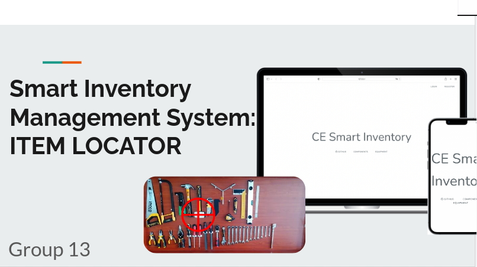
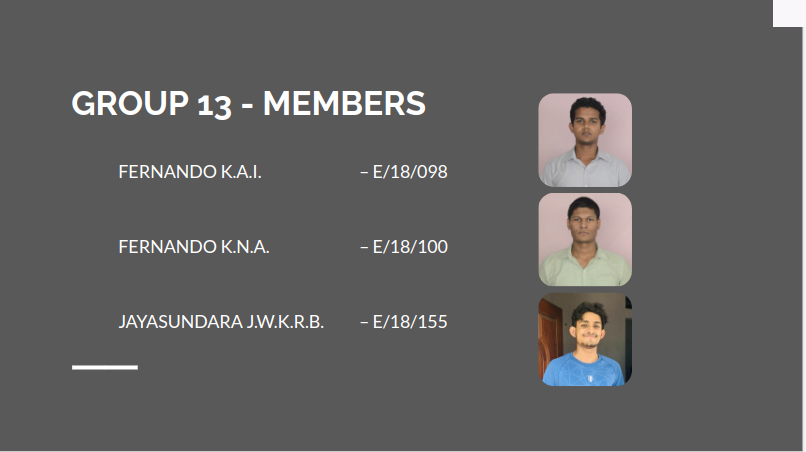

[comment]: # "This is the standard layout for the project, but you can clean this and use your own template"

# Smart Inventory Management System - Item Locator

---

## Team
-  E/18/098, Fernando K.A.I., [e18098@eng.pdn.ac.lk](mailto:e18098@eng.pdn.ac.lk)
-  E/18/100, Fernando K.N.A, [e18100@eng.pdn.ac.lk](mailto:e18100@eng.pdn.ac.lk)
-  E/18/155, Jayasundara J.W.K.R.B., [e18155@eng.pdn.ac.lk](mailto:e18155@eng.pdn.ac.lk)

## Table of Contents
1. [Introduction](#introduction)
2. [Other Sub Topics](#other-sub-topics)
3. [Links](#links)

---

## Introduction

 description of the real world problem and solution, impact

## Other Sub Topics

.....

## Links

- [Project Repository](https://github.com/cepdnaclk/e18-co227-Smart-Inventory-Management-System-Group-A){:target="_blank"}
- [Project Page](https://cepdnaclk.github.io/e18-co227-Smart-Inventory-Management-System-Group-A){:target="_blank"}
- [Department of Computer Engineering](http://www.ce.pdn.ac.lk/)
- [University of Peradeniya](https://eng.pdn.ac.lk/)

[//]: # (Please refer this to learn more about Markdown syntax)
[//]: # (https://github.com/adam-p/markdown-here/wiki/Markdown-Cheatsheet)
